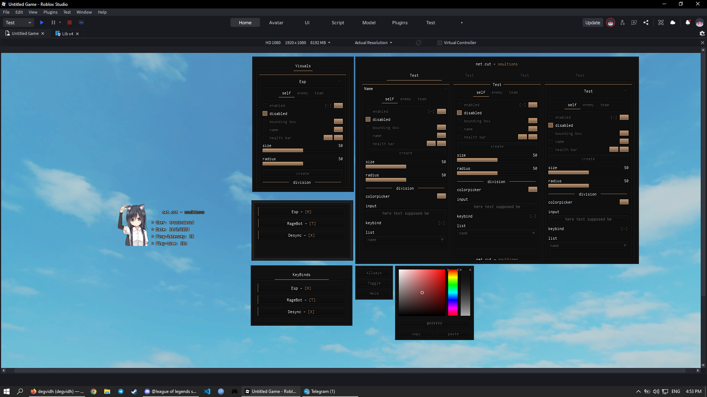

# 📦 Roblox UI Library – Usage Documentation

## 🧠 Overview

This is a custom Roblox UI library that allows you to quickly create:

* Windows
* Tabs
* Sections (Frames)
* Buttons
* Toggles
* Addons (e.g. Color Pickers)

It follows a structured, object-based (OOP-style) approach using metatables.

---

# 🚀 Getting Started

### 1. Load the library

```lua
local library = loadstring(game:HttpGet("YOUR_GITHUB_RAW_LINK"))()
```

---

# 🪟 Creating the Main Window

```lua
local window = library:New({
    Size = UDim2.fromOffset(768, 562) -- optional
})
```

### Returns:

```lua
window = {
    currenttab,
    isVisible,
    framebuttons,
    framecontainers,
    screenGui
}
```

---

# 📑 Creating Tabs

```lua
local tab = window:NewTab({
    Text = "Main"
})
```

### Notes:

* First tab created is automatically selected
* Clicking switches between tabs

---

# 📦 Creating Frames (Sections)

```lua
local section = tab:NewFrame({
    Name = "Settings",
    SizeY = 250,
    Side = 1 -- 1, 2, or 3 (column layout)
})
```

### Options:

| Property | Description                              |
| -------- | ---------------------------------------- |
| `Name`   | Title of the section                     |
| `SizeY`  | Height                                   |
| `Side`   | Column (1 = left, 2 = middle, 3 = right) |

---

# 🔘 Button

```lua
section:NewButton({
    Text = "Click Me",
    Callback = function()
        print("Button clicked")
    end
})
```

---

# 🔁 Toggle

```lua
local toggle = section:NewToggle({
    Text = "Enable Feature",
    CallBack = function(state)
        print("Toggle state:", state)
    end
})
```

### Behavior:

* Click to toggle ON/OFF
* Returns `true` / `false` in callback

---

# 🎨 Addons (Color Picker)

After creating a toggle:

```lua
local toggle = section:NewToggle({
    Text = "Color Option",
    CallBack = function(state)
        print(state)
    end
})

toggle:AddColorPicker()
```

### Notes:

* Attaches a color picker UI to the toggle
* Includes:

  * Color gradient
  * Rainbow selector
  * Transparency slider

---

# 🎯 Example Full Usage

```lua
local library = loadstring(game:HttpGet("YOUR_LINK"))()

local window = library:New()

local tab = window:NewTab({
    Text = "Main"
})

local section = tab:NewFrame({
    Name = "Gameplay",
    SizeY = 200,
    Side = 1
})

section:NewButton({
    Text = "Print Hello",
    Callback = function()
        print("Hello")
    end
})

local toggle = section:NewToggle({
    Text = "God Mode",
    CallBack = function(state)
        print("God Mode:", state)
    end
})

toggle:AddColorPicker()
```

---

# 🧩 Layout System

Each tab has **3 scrolling columns**:

```lua
tab.scrollingframes[1] -- Left
tab.scrollingframes[2] -- Middle
tab.scrollingframes[3] -- Right
```

You control placement using:

```lua
Side = 1 | 2 | 3
```

---

# 🎨 Theme (Default)

```lua
theme = {
    accent        = Color3.fromRGB(190, 150, 115),
    lightcontrast = Color3.fromRGB(17, 17, 17),
    darkcontrast  = Color3.fromRGB(15, 15, 15),
    outline       = Color3.fromRGB(0, 0, 0),
    inline        = Color3.fromRGB(33, 33, 33),
    textcolor     = Color3.fromRGB(255, 255, 255),
    textdark      = Color3.fromRGB(100, 100, 100),
    textsize      = 12
}
```

---

# 🛠 Utility Features (Internal)

The library includes helper systems for:

* UI creation (`utility:Create`)
* Tween animations
* Dragging frames
* Mouse detection
* Text sizing
* Color manipulation

---

# 🧹 Notes

* UI is draggable by default
* Tabs animate on hover and click
* Elements use TweenService for smooth transitions
* Connections are internally tracked

---

# 📌 Summary

### Core Flow:

```lua
library → window → tab → frame → element
```

### Elements available:

* Button
* Toggle
* ColorPicker (addon)

---

# ✅ Done

You can now build full UIs using a clean structured system.

---
